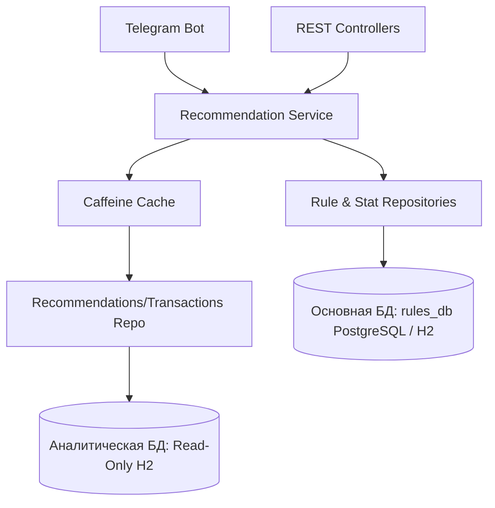

# skypro-recommendation-credit-product

Проект выполняется в формате **Solo Developer**. Все ключевые роли на протяжении жизненного цикла разработки
микросервиса закреплены за одним исполнителем:

* **Project Manager / Аналитик (`Sergey`)** — планирование спринтов в GitHub Projects, управление требованиями, ведение
  проектной документации в Wiki.
* **Lead Developer / Архитектор (`Sergey`)** — проектирование архитектуры микросервиса, создание схемы базы данных и
  выбор паттернов проектирования.
* **Java Developer (`Sergey`)** — написание кода сервиса рекомендаций, реализация бизнес-логики, создание REST API и
  оптимизация SQL-запросов.
* **QA Engineer (`Sergey`)** — написание модульных и интеграционных тестов (JUnit), ручное тестирование API через
  Postman.

## Архитектура системы

Микросервис спроектирован с учетом требований высокой производительности, отказоустойчивости и изоляции данных. Для
оптимизации нагрузок система разделена на два независимых контура хранения:

1. **Операционный контур (Основная БД — PostgreSQL / H2):**
    * **Назначение:** Хранение учетных записей пользователей (`users`), динамических правил рекомендаций (
      `dynamic_rules`), условий выполнения (`query_conditions`, `query_arguments`) и агрегированной статистики
      срабатываний (`rule_stats`).
    * **Тип доступа:** Read/Write (полный доступ на чтение, создание, обновление и каскадное удаление данных).
    * **Управление схемой:** Миграции базы данных полностью автоматизированы с помощью инструмента Liquibase.

2. **Аналитический контур (Аналитическая БД — H2):**
    * **Назначение:** Хранение истории транзакций клиентов (`transactions`) для проведения скоринга и проверки условий
      динамических правил.
    * **Тип доступа:** **Read-Only** (строго только для чтения). Это гарантирует, что аналитический движок рекомендаций
      никак не сможет случайно модифицировать или повредить финансовую историю клиента.
    * **Оптимизация производительности:** Чтобы избежать деградации базы данных при частых аналитических запросах (
      тяжелые операции `COUNT` и `SUM` по миллионам транзакций), слой репозитория интегрирован с локальным кэшем *
      *Caffeine Cache**. Результаты вычислений кэшируются в оперативной памяти приложения.

## Диаграмма компонентов системы

Потоки данных и связи между компонентами приложения выглядят следующим образом:

## Инструкция по развертыванию и запуску проекта

### Требования

* Java 17
* Maven 3.x (или встроенный mvnw)

### Шаги для запуска

1. Склонируйте репозиторий с проектом.
2. Проверьте настройки подключения к базам данных и токен Telegram-бота в файле
   `src/main/resources/application.properties`.
3. Соберите проект и сгенерируйте метаданные сборки с помощью Maven:
   Раскройте вкладку **Maven** (в правом боковом меню IntelliJ IDEA) -> папка **Lifecycle** -> запустите **clean**, а
   затем дважды кликните по **package**.
4. После появления сообщения `BUILD SUCCESS` запустите приложение через стандартную зеленую стрелочку `Run` в верхней
   панели вашей IDE.

## Доступ к интерфейсам управления

* **REST API & Документация (Swagger UI):** доступно после запуска по адресу
  `http://localhost:8080/swagger-ui/index.html`
* **Пользовательский интерфейс:** Telegram-бот, осуществляющий асинхронное взаимодействие с клиентами по команде
  `/recommend <username>`.